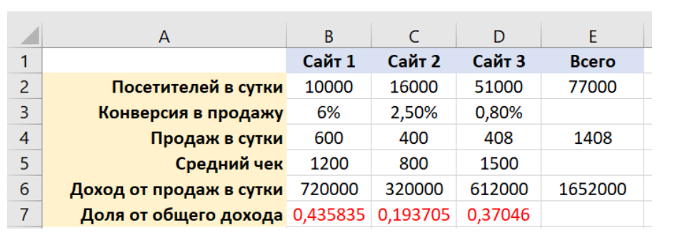
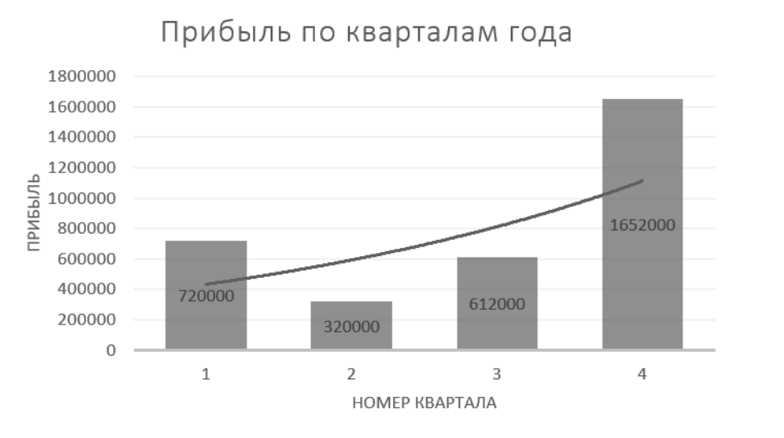
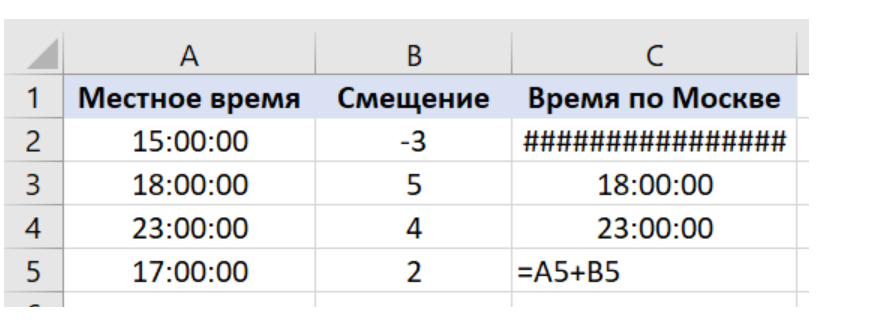
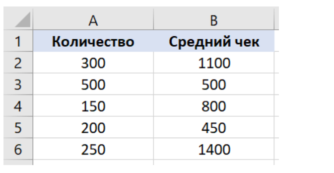
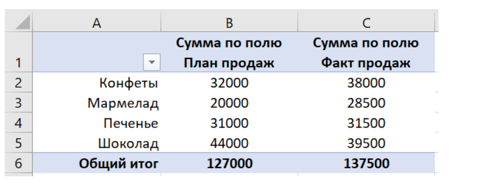

## Excel — продвинутый уровень

🏆 Правильных ответов: 16 из 18. 

#### Q1. Вы хотите, чтобы в ячейке отображались текущие дата и время. Пример отображения: 31.01.20 00:01. Какая формула должна стоять в ячейке?

- [x] `=ТЕКСТ(ТДАТА();"ДД.ММ.ГГ ЧЧ:ММ")`

#### Q2. Каким образом выполнить сортировку данных в таблице по нескольким столбцам?

- [x] В диалоговом окне «Сортировка» во вкладке «Данные» > «Сортировка и фильтр» добавить к сортировке столбцы с помощью кнопки «Добавить уровень»

#### Q3. Какая формула должна находиться в ячейке B7, чтобы, растягивая это значение в ячейки справа, вы получили корректный результат?

- [x] `=B6/$E6`

#### Q4. Внутри формулы суммирования вы хотите создать ссылку на диапазон ячеек C1:C5, который находится на другом листе с названием Инвентаризация товара. Как будет выглядеть формула?

- [x] `=СУММ('Инвентаризация товара'!C1:C5) или =SUM('Инвентаризация товара'!C1:C5)`

#### Q5. Когда вы допускаете опечатки (например, случайное нажатие CAPS LOCK), MS Excel исправляет правописание. Вы хотите отключить эту возможность. Как это можно сделать?

- [x] В диалоговом окне «Параметры Excel» во вкладке «Параметры автозамены…» снять галочки напротив функций исправления опечаток

#### Q6. Какое утверждение НЕВЕРНО?

- [x] Попытка применения функции СЦЕПИТЬ (CONCATENATE) на числовых строках вызовет ошибку

#### Q7. Данные, с которыми вы хотите работать, представлены на нескольких листах Excel-файла. Что из перечисленного НЕ является способом объединения таких данных на одном листе?

- [x] Команда «Группировать» на листе «Данные»

#### Q8. Какой элемент диаграммы ОТСУТСТВУЕТ на этом графике?

- [x] Легенда

#### Q9. Вы хотите выделить дублирующиеся данные в столбце определенным цветом. Как вы можете это сделать?

- [x] На главной вкладке в поле «Условное форматирование» выбрать «Правила выделения ячеек» > «Повторяющиеся значения…»

#### Q10. Вы хотите преобразовать местное время на московское для каждого из случаев в столбце A. Для этого вы указали разницу в часах между местным и московским временем в столбце «Смещение» и использовали формулу, пример которой приведен в столбце C5. В столбцах A и C настроен формат времени, в столбце B — числовой формат.

Но применение формулы не дало нужных результатов. Как нужно изменить формулу в столбце C5, чтобы получить верное вычисление времени по Москве?

- [x] `=A5+B5/24`

#### Q11. В таблице — количество покупок и средний чек одной покупки по пяти типам услуг. Используя формулу массива, посчитайте СРЕДНЮЮ СТОИМОСТЬ одного типа услуг.

Стоимость одного типа услуг рассчитывается через умножение количества на средний чек. Учитывайте, что для ячеек столбцов A и B задано имя по названию этих столбцов.

Извините за путаницу. Верное решение задачи с использованием формулы массива будет следующим:

- [x] `=СУММПРОИЗВ(Количество*Средний_чек) или =SUMPRODUCT(Количество*Средний_чек)` 

#### Q12. Что НЕЛЬЗЯ сделать при создании новой сводной таблицы в Excel, используя готовые функции мастера сводных таблиц?

- [x] Создать сводную таблицу из нескольких листов

#### Q13. Вы создали сводную таблицу по плану и факту продаж в зависимости от категории товара. Вы хотите добавить еще один столбец, в котором будет подсчитана доля выполнения плана по каждой категории товара. Как вы это сделаете?

- [x] На вкладке в поле «Работа со сводными таблицами» > «Анализ» выбрать «Поля, элементы и наборы» > «Вычисляемое поле…»

#### Q14. Какое утверждение о макросах НЕВЕРНО?

- [x] Нельзя внести изменения в уже записанный макрос

#### Q15. Вы знаете сумму займа и процентную ставку. Сумма ежегодной выплаты определяется функцией ПЛТ() в ячейке B4. Вы хотите определить оптимальный срок займа (для которого предназначена ячейка B2), зная комфортный ежегодный платеж. Какой инструмент Excel вам в этом поможет?

- [x] Средство подбора параметров

#### Q16. Что такое спарклайн в Excel?

- [x] Небольшая диаграмма, помещенная в одну ячейку

#### Q17. Какую функцию или набор функций вы будете использовать для формирования динамических диапазонов?

- [x] СМЕЩ() или OFFSET()

#### Q18. Какой основной недостаток есть у сценариев в Excel?

- [x] Значения исходных данных не находятся на листе, а скрыты в Диспетчере сценариев

