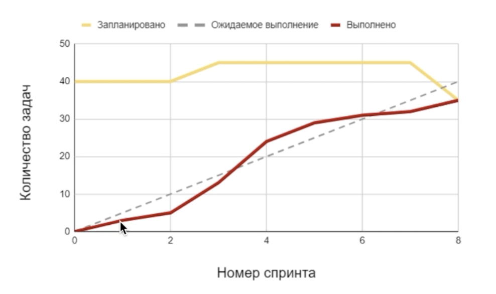

## Scrum — продвинутый уровень

🏆 Правильных ответов: 16 из 17.

#### Q1. Какая из ситуаций иллюстрирует принципы распределения ответственности и полномочий в команде, характерные для Scrum?

- [x] Для принятия решений по реализации функции разработчики общаются с заинтересованными лицами (stakeholders) напрямую

#### Q2. В основе Scrum-методологии лежат итеративный и инкрементальный подходы. Какое из утверждений о преимуществе этих подходов НЕВЕРНО?

- [x] В итеративном подходе просто управлять версиями и изменениями в продукте

#### Q3. Какое из утверждений о принципе прозрачности в Scrum ОШИБОЧНО?

- [x] Все члены команды могут вносить изменения в бэклог продукта (Product Backlog), чтобы ставить в известность команду о своих приоритетах

#### Q4. Вы управляете командой, которая создает контент для платформы с онлайн-тренировками. Ваша текущая продуктовая цель — повысить среднюю продолжительность платной подписки пользователя на сервис.
Ваш Scrum-мастер организовал встречу для приоритезации бэклога продукта, поскольку считает процессы к команде неэффективными. С точки зрения Scrum, какая из задач в бэклоге продукта является наиболее приоритетной?

- [x] Повысить разнообразие предлагаемых типов тренировок

#### Q5. Ваша команда разрабатывает функцию поиска предметов одежды по их цвету для онлайн-магазина. Вы приближаетесь к концу спринта, но не успеваете протестировать новую функцию на всех устройствах.
Каким образом, с точки зрения Scrum, будет НАИМЕНЕЕ предпочтительно действовать в этом спринте, чтобы исправить эту ситуацию?

- [x] Увеличить продолжительность спринта, чтобы успеть провести тестирование

#### Q6. Перед вами — диаграмма сгорания задач наоборот (burnup chart) по одному проекту. Какой из выводов о работе команды за этот период соответствует этому графику?

- [x] К концу проекта команда сократила объем запланированной работы, чтобы закончить проект в срок

#### Q7. Вы хотите совмещать Kanban и Scrum в управлении командой. Какое из утверждений о сходстве подходов Scrum и Kanban ОШИБОЧНО?

- [x] И Scrum, и Kanban предполагают создание бэклога задач на весь спринт перед началом этого спринта

#### Q8. Вас пригласили помочь команде по созданию функционала сообществ внутри крупной социальной сети. В команде работает 15 разработчиков и менеджеров. Команда сталкивается с систематической проблемой задержки выпуска новых инкрементов, поскольку многие задачи зависят от работы, которую выполняют внешние команды платформы и баз данных, и они регулярно задерживаются. Вы предложили команде внедрение фреймворка Nexus для решения этой проблемы.
С точки зрения фреймворка Nexus, какой способ разрешить эту проблему будет наиболее подходящим?

- [x] Создать в компании интеграционную команду (Integration Team), которая идентифицирует зависимости между задачами и поможет управлять ими

#### Q9. Вы работаете в Scrum-команде, которая занимается продвижением продукции и бренда производителя здорового питания в социальных сетях. Соотнесите каждую проблему с методикой, внедрение которой поможет разрешить возникшую проблему.

A — Команда не поняла, какие изменения в брендинге компании ожидают руководители

B — Команда не может оценить объем работы, связанной с запуском кулинарного YouTube-канала для продвижения продукции

C — Команда не ощущает улучшений в рабочих процессах после привычных ретроспектив спринтов

1 — Ежедневные стендапы (Daily Scrum)

2 — Покер планирования (Planning Poker)

3 — Ревью спринта (Sprint Review)

4 — Ретроспектива Морская Звезда (Starfish Retrospective)

- [x] A — 3, B — 2, C — 4

#### Q10. В этом спринте вы с командой создаете новый игровой уровень для вашей видеоигры. Дизайнер уровней считает эту задачу несложной, поскольку, по его мнению, они требует только создания новых игровых объектов. В то же время опытный разработчик с большим игровым опытом считает, что разработка такого уровня потребует полного пересмотра баланса игровой сложности.
С точки зрения Scrum, какой из способов разрешения этой ситуации наиболее эффективен?

- [x] Использовать покер планирования (Scrum Poker) для определения компромиссной оценки сложности задачи всей командой

#### Q11. Ваша команда разрабатывает социальную сеть для делового нетворкинга. Сейчас вы анализируете возможные риски. Соотнесите проблему, с которой может столкнуться команда, и метрику производительности команды, отслеживание которой позволит избежать этой проблемы.

A — Задержка выполнения задачи по разработке прототипа интерфейса вследствие непонятных требований

B — Перегрузка команды, разрабатывающий модели машинного обучения, во время реализации функции поиска

C — Перегруженность команды задачами в последнем спринте перед большим релизом

1 — Диаграмма сгорания работ (Burndown Chart)

2 — Время цикла (Cycle Time)

3 — Распределение рабочей нагрузки (Workload Distribution)

- [x] A — 2, B — 3, C — 1

#### Q12. Ниже — три задачи по управлению рисками проекта в Scrum-команде и три принципа Scrum-подхода. Соотнесите каждую задачу с принципом, который наиболее ее характеризует.

A — На каждой ретроспективе команда обсуждает, какие непредвиденные риски оказали наибольшее влияние на выполнение задач

B — Владелец продукта поддерживает актуальность бэклога продукта, в котором отражены возможные глобальные и рыночные риски

C — Scrum-мастер ежемесячно обновляет риск-матрицу проекта, чтобы идентифицировать новые риски и оценить их влияние на достижение целей

1 — Принцип прозрачности

2 — Принцип инспекции

3 — Принцип эмпирического контроля процесса

- [x] A — 2, B — 3, C — 1

#### Q13. В команде разработчиков программ для автоматизации розничной торговли после роста до 40 человек перешли на новый, масштабируемый фреймворк управления проектами. Сейчас в команде один владелец продукта, один бэклог продукта и 5 команд — каждая отвечает за отдельную пользовательскую функцию (фиче-команды). Организованы как общие встречи по планированию и ревью результатов, так и внутри каждой команды. Других дополнительных ролей в команде не появилось.
Какой подход к масштабированию Scrum отражен в этом кейсе?

- [x] Large-Scale Scrum (LeSS)

#### Q14. Владелец продукта в команде, с которой вы сейчас работаете, решает внедрить методики дизайн-мышления в этап проектирования продукта. Какая из следующих практик дизайн-мышления НЕ сочетается со Scrum-подходом?

- [x] Единственно важное в определении требований к продукту — мнение и потребности потенциального клиента

#### Q15. Команда разработки сталкивается с нестабильными требованиями от одного из ключевых заинтересованных лиц в течение спринта. Какой из вариантов разрешения этой ситуации НЕ согласуется со Scrum-фреймворком?

- [x] Пригласить заинтересованное лицо на ежедневные стендапы, чтобы он отслеживал, что работа команды соответствует его требованиям

#### Q16. Какое утверждение о роли Scrum-метрик ЛОЖНО?

- [x] Показатели Scrum позволяют измерить ценность конечного продукта для клиента или заказчика

#### Q17. Вас пригласили внедрить Scrum на производственном предприятии. Какое из действий в этом случае НАИМЕНЕЕ эффективно для процесса производства?

- [x] Вы хотите повысить кросс-функциональность команды, увеличив число работников широкого профиля вместо узкоспециализированных специалистов
