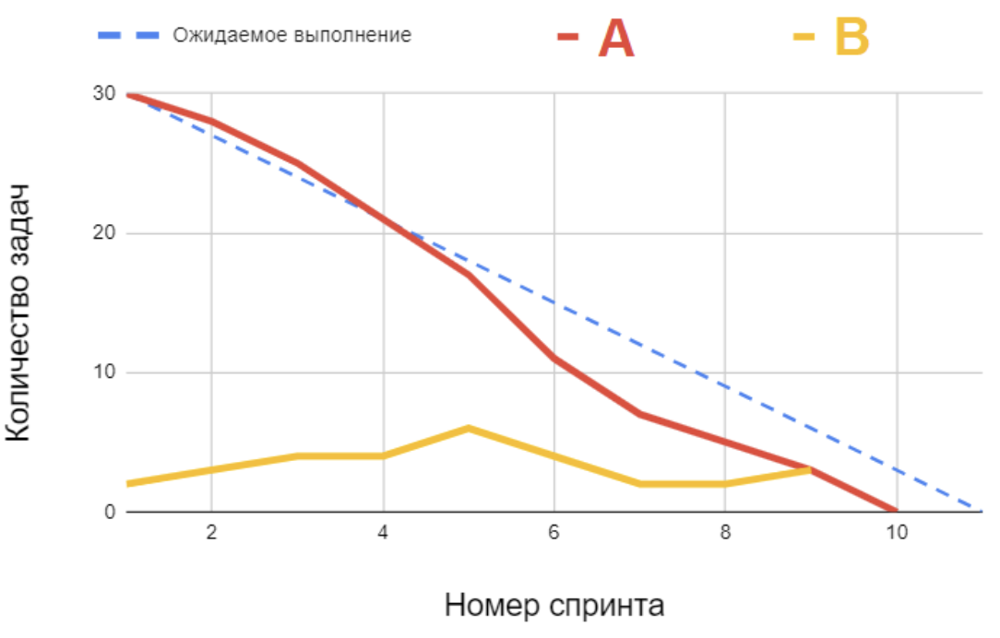

## Scrum — средний уровень

🏆 Правильных ответов: 11 из 13.

#### Q1. Какая из перечисленных задач НЕ относится к зоне ответственности владельца продукта (Product Owner) в Scrum?

- [x] Распределять задачи между разработчиками и контролировать их работу

#### Q2. Что такое критерии готовности (Definition of Done) в Scrum?

- [x] Обязательные условия, которые нужно выполнить для того, чтобы считать инкремент и связанные с ним задачи выполненными

#### Q3. В вашей команде один спринт длится три недели. С точки зрения общепринятой Scrum-методологии, сколько времени после завершения спринта и для какой цели требуется для подготовки к следующему спринту?

- [x] Нисколько, следующий спринт начинается сразу после предыдущего

#### Q4. Кто в Scrum-команде несет ответственность за выполнение задач в установленные сроки?

- [x] Каждый член команды

#### Q5. Какое из утверждений об итеративности процесса разработки продукта НЕ относится к Scrum-подходу?

- [x] Последовательность цикла работы над проектом утверждается заранее и фиксируется в документации проекта

#### Q6. Вы анализируете производительность команды, для чего вы построили график скорости (Velocity), с которой команда выполняет свою работу. Какой из выводов соответствует этому графику?

- [x] На начальных стадиях проекта команде понадобилось время, чтобы влиться в рабочие процессы

#### Q7. Ваша команда разрабатывает сервис бронирования отелей. В этом спринте вы добавили на страницу каждого отеля отображение его места на карте с указанием ближайших достопримечательностей, но не успели оценить ее полезность. Scrum-мастер заметил, что скорость выполнения задач снизилась по сравнению с предыдущим спринтом. С точки зрения Scrum-подхода, чему стоит посвятить РЕТРОСПЕКТИВУ этого спринта?

- [x] Проанализировать метрики производительности команды в этом спринте и обсудить, как улучшить эффективность процессов

#### Q8. Вы управляете командой дизайнеров в компании по производству мороженого. Продуктовая цель компании - разработать новую линейку мороженого для детей, для которых раньше фирма не предлагала отдельной продукции. Также месяц назад вышли новые федеральные экологические стандарты для упаковок продуктов. Ваш Scrum-мастер организовал встречу для приоритизации бэклога продукта, поскольку считает процессы к команде неэффективными. С точки зрения Scrum, какая из задач в бэклоге продукта является наиболее приоритетной?

- [ ] Повысить экологичность материала упаковки
- [x] Исследовать предпочтения и интересы новой целевой аудитории

#### Q9. Ваша команда разрабатывает новые функции для приложения интернет-банка. В этом спринте ваша цель — создать систему подтверждающих уведомлений об операциях. Какое изменение, произошедшее в середине спринта, будет ПРОТИВОРЕЧИТЬ Scrum?

- [x] Scrum-мастер изменил цель спринта на новую - доработку функции управления балансом карт

#### Q10. Перед вами — диаграмма сгорания задач (Burndown Chart). Подпишите ее недостающие части — на графике они указаны под буквами А и В.

- [ ] А - количество оставшихся задач в рамках всего проекта, В — разница между запланированными и выполненными задачами
- [ ] А — количество оставшихся задач в отдельном спринте, В — количество запланированных для выполнения задач в отдельном спринте
- [ ] А — количество выполненных задач в рамках всего проекта, В — количество запланированных для выполнения задач в отдельном спринте
- [x]  А - количество оставшихся задач в рамках всего проекта, В — количество выполненных задач в отдельном спринте
- [ ] А — количество выполненных задач в рамках всего проекта, В — разница между запланированными и выполненными задачами

#### Q11. Команда разработчиков пожаловалась, что сталкивается с частыми изменениями требований и несистемным подходом к приоритизации задач со стороны владельца продукта. Внедрение какого инструмента будет наиболее эффективным для решения этой проблемы?

- [x] Критерии завершенности (Definition of Ready)

#### Q12. Ниже — три задачи в Scrum-команде, связанные с управлением рисками, и принципы, на которых основывается Scrum. Соотнесите каждую задачу с принципом, которому она больше соответствует.

А — Scrum-мастер анализирует сложность задач в сторипоинтах с учетом возможных рисков и неопределенности
В - Владелец продукта вносит риски в описание элементов бэклога проекта, которое доступно всей команде
С - Scrum-мастер завел пространство, куда команда заносит произошедшие проблемные ситуации для их учета в будущем

1 - Принцип прозрачности (Transparency)
2 - Принцип бережливого мышления (Lean Thinking)
3 - Принцип итеративности разработки (Iterative Delivery)
4 - Принцип инспекции (Inspection)

- [x] А - 3, В - 2, С - 4
- [ ] А - 2, В - 1, С - 4
- [ ] А - 1, В - 4, С - 2
- [ ] А - 4, В - 3, С - 1
- [ ] А - 3, В - 1, С - 2

#### Q13. Что из перечисленного вы НЕ станете обсуждать на ежедневном стендапе Scrum-команды?

- [x] Какова бизнес-ценность инкремента, который разрабатывается в этом спринте
